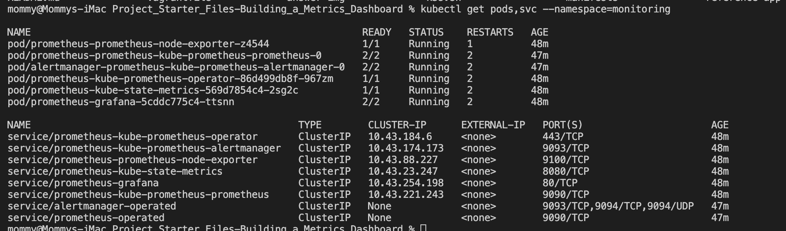
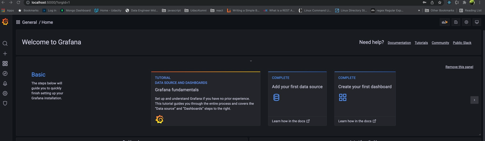
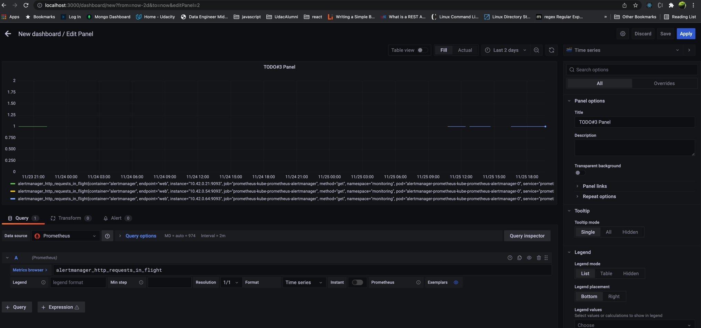
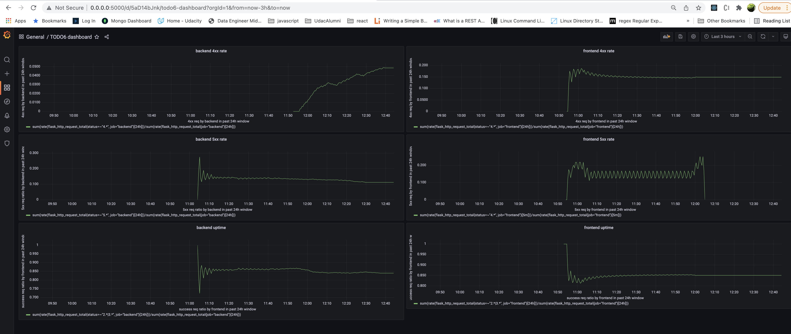
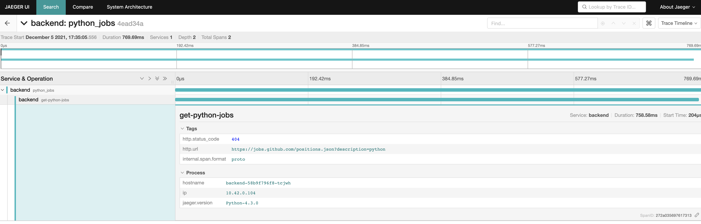
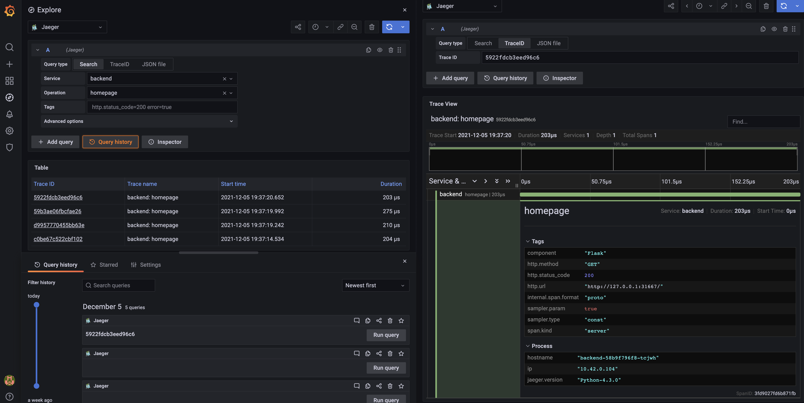
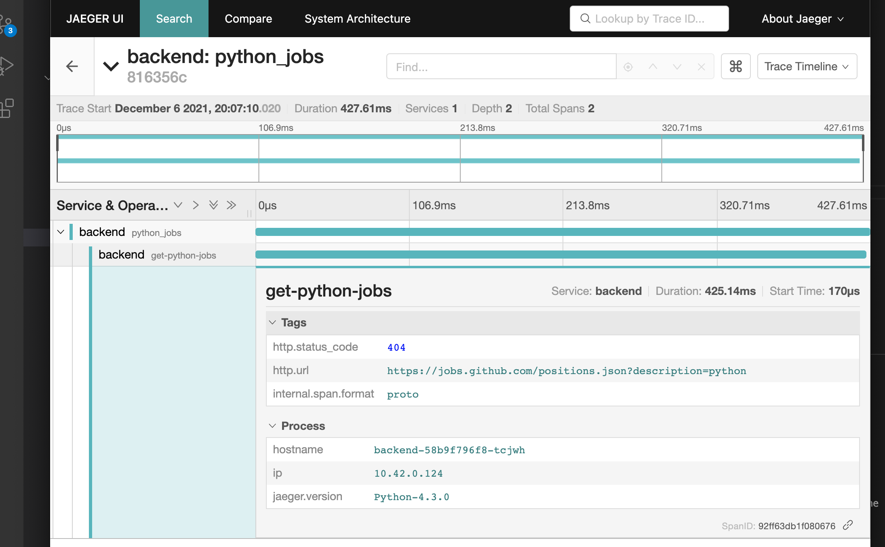
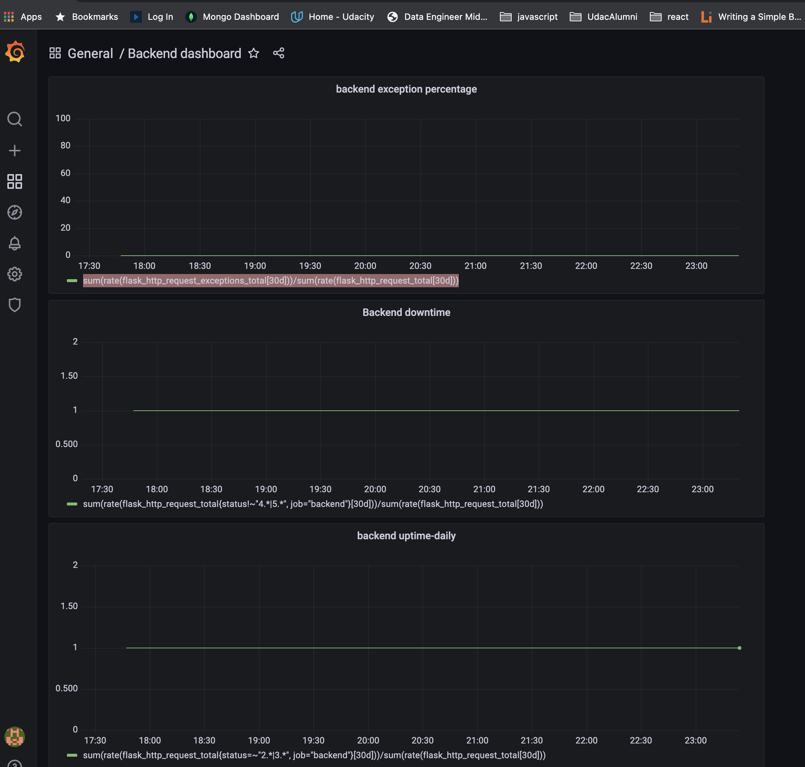
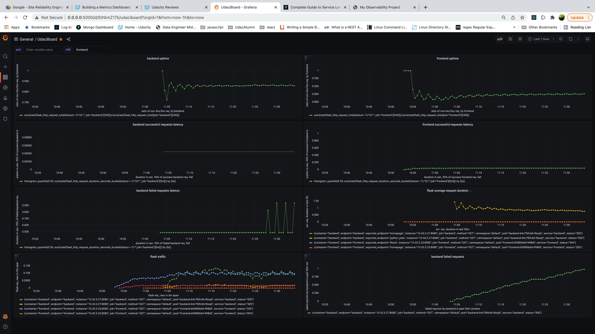

**Note:** The screenshots are named with the TODO #s, and are in the `answer-img` directory.

## Verify the monitoring installation

*TODO1:* run `kubectl` command to show the running pods and services for all components. Take a screenshot of the output and include it here to verify the installation

## Setup the Jaeger and Prometheus source
*TODO2:* Expose Grafana to the internet and then setup Prometheus as a data source. Provide a screenshot of the home page after logging into Grafana.

## Create a Basic Dashboard
*TODO3:* Create a dashboard in Grafana that shows Prometheus as a source. Take a screenshot and include it here.

## Describe SLO/SLI
*TODO4:* Describe, in your own words, what the SLIs are, based on an SLO of *monthly uptime* and *request response time*.
If the SLO is "99% monthly Uptime", then the SLI could be the measurement of "proportion HTTP requests that return with 2XX and 3XX status". 
If the SLO is "99% of all requests will take less than 20ms in a given month (Latency)", then an SLI can be expressed as the "percentage of requests successfully retrieving before 20ms over the past month".

*TODO5:* It is important to know why we want to measure certain metrics for our customer. Describe in detail 5 metrics to measure these SLIs. 
- 5.1 traffic: We want to know how often our customers are visiting our application. With that in mind, we can have a SLO of "in the past hour per-second http requests is fewer than 100",  with corresponding SLI of "per-second rate of HTTP requests as measured over the last 1 hour"; the metric can be : `rate(http_requests_total[1h])` 
- 5.2 latency: We want our customers to have reasonable response time on our applications. With that in mind, we can have a SLI of "average request duration during the last 5 minutes"; the metric can be: `rate(flask_http_request_duration_seconds_sum[5m])/rate(flask_http_request_duration_seconds_count[5m])`. However, measuring average for latency can be misleading. See 5.3 and 5.4.
- 5.3 latency: If the SLO is "99% of all requests will take less than 20ms in a given month (Latency)", then an SLI can be expressed as the "percentage of requests successfully retrieving before 20ms over the past month"; metric can be: `sum(rate(prometheus_http_request_duration_seconds_bucket{le="0.02"}[5m])) by (job)/  sum(rate(prometheus_http_request_duration_seconds_count[5m])) by (job)`
so that we can alert when the ratio goes below 99%, or 
- 5.4 latency(continue from 5.3): given the same SLO as in 5.3, another SLI could be the 95th percentile, i.e. "the request duration within which 95% of all requests fall"; the metric could be:
`histogram_quantile(0.95, sum(rate(prometheus_http_request_duration_seconds_bucket[5m])) by (le))`
- 5.5 error: "Error is the rate of requests that fail in any of the following ways: 
Explicitly: for example, HTTP 500 internal server error.
Implicitly: for example, HTTP 200 success response coupled with inaccurate content.
By policy: for example, as your response time is set to one second, any request that takes over one second is considered an error." 
An SLI can be "percentage of 5xx response status code"; the metric can be: `http_requests_total{status=~"5.*"}/http_requests_total`.
Suppose I care about the absolute number of 5xx from the backend service, the SLO could be "fewer than 5 flask http calls (measured over the last 24 hours) end up with 5xx (measured across all the frontend servers).", the metric would be `flask_http_request_total{status=~"5.*", job="backend"}[24h]))`

- 5.6 saturation: 
"how much memory or CPU resources the system is utilizing....An increase in latency is often a leading indicator of saturation.". The metrics are:
//unused memory in MiB for every instance (on a fictional cluster scheduler exposing these metrics about the instances it runs):
`(instance_memory_limit_bytes - instance_memory_usage_bytes) / 1024 / 1024` 
//the top 3 CPU users grouped by application (app) and process type (proc) like this:
`topk(3, sum by (app, proc) (rate(instance_cpu_time_ns[5m])))`
- 5.7 availability: We want our app to be available to our customers most of the time. The SLO can be "app has 95% availability in a rolling 24h window." , the corresponding SLI can be "the ratio of non-error requests in the past 24h"; and the metric: `sum(rate(flask_http_request_total{status!~"4.*|5.*", job="backend"}[24h]))/sum(rate(flask_http_request_total{job="backend"}[24h]))` for backend or `sum(rate(flask_http_request_total{status!~"4.*|5.*", job="frontend"}[24h]))/sum(rate(flask_http_request_total{job="frontend"}[24h]))` for frontend

## Create a Dashboard to measure our SLIs
*TODO6:* Create a dashboard to measure the uptime of the frontend and backend services. We will also want to measure to measure 40x and 50x errors. Create a dashboard that show these values over a 24 hour period and take a screenshot.
- backend uptime: `sum(rate(flask_http_request_total{status=~"2.*|3.*", job="backend"}[24h]))/sum(rate(flask_http_request_total{job="backend"}[24h]))`
- backend 4xx rate:`sum(rate(flask_http_request_total{status=~"4.*", job="backend"}[24h]))/sum(rate(flask_http_request_total{job="backend"}[24h]))`
- backend 5xx rate:`sum(rate(flask_http_request_total{status=~"5.*", job="backend"}[24h]))/sum(rate(flask_http_request_total{job="backend"}[24h]))`
- frontend uptime: `sum(rate(flask_http_request_total{status=~"2.*|3.*", job="frontend"}[24h]))/sum(rate(flask_http_request_total{job="frontend"}[24h]))`
- frontend 4xx rate:`sum(rate(flask_http_request_total{status=~"4.*", job="frontend"}[24h]))/sum(rate(flask_http_request_total{job="frontend"}[24h]))`
- frontend 5xx rate:`sum(rate(flask_http_request_total{status=~"5.*", job="frontend"}[24h]))/sum(rate(flask_http_request_total{job="frontend"}[24h]))`

## Tracing our Flask App
*TODO7:*  We will create a Jaeger span to measure the processes on the backend. Once you fill in the span, provide a screenshot of it here.

## Jaeger in Dashboards
*TODO8:* Now that the trace is running, let's add the metric to our current Grafana dashboard. Once this is completed, provide a screenshot of it here.

## Report Error
*TODO9:* Using the template below, write a trouble ticket for the developers, to explain the errors that you are seeing (400, 500, latency) and to let them know the file that is causing the issue.
Name: My Name, email, phone

Date: Dec5, 2021.

Subject: Error in "backend" project, on "GET /pythonjobs"

Affected Area: "backend" project, span "get-python-jobs"

Severity: Critical(404)

Description: Dashboard link: see TODO9_backend_404.png in answer-img/.

## Creating SLIs and SLOs
*TODO10:* We want to create an SLO guaranteeing that our application has a 99.95% uptime per month. Name three SLIs that you would use to measure the success of this SLO.
- `sum(rate(flask_http_request_total{status=~"2.*|3.*", job="backend"}[30d]))/sum(rate(flask_http_request_total{job="backend"}[30d]))` > 99.95%
- `sum(rate(flask_http_request_total{status!~"4.*|5.*", job="frontend"}[30d]))/sum(rate(flask_http_request_total{job="frontend"}[30d]))` > 99.95%
- `sum(rate(flask_http_request_exceptions_total[30d]))/sum(rate(flask_http_request_total[30d]))` < 0.05%
- `sum(rate(flask_http_request_total{status=~"2.*|3.*", job="frontend"}[30d]))/sum(rate(flask_http_request_total{job="frontend"}[30d]))` > 99.95%

## Building KPIs for our plan
*TODO11*: Now that we have our SLIs and SLOs, create KPIs to accurately measure these metrics. We will make a dashboard for this, but first write them down here.
In TODO5: I have listed SLO/SLIs for the Four Golden Signals: Latency, Traffic, Errors, Saturation, Availability. 
Since the flasks apps in our project include a user-facing "frontend" app and its partner at the back, "backend" app, availability, latency, and throughput(ie traffic) and errors are essential for smooth user experience. I will list them below. 
(Note: I will have to agree with Marcin in his post regarding the relationship between KPI and SLI: https://knowledge.udacity.com/questions/693931. The term  KPI predates
google's SLO and SLI. KPI is what business world describes a measurement of certain goals, much as SLI is used to describe measurement of goals in the context of services
such as microservices. Below is my attempt in light of the requirements "a list of 2-3 specific KPIs per each SLI".)

SLI 1: Latency (see references $1, $2)
"Latency is the time it takes a system to respond to a request. Both successful and failed requests have latency and it’s vital to differentiate between the latency of successful and failed requests." I used KPI 1.3 to illustrate the latter point.
Considering that we also care about the shape of the latency, below are two SLOs based on percentile:
SLO 1.1 (of one nine): 90% (averaged over last 5 minute) of successful flask http calls will complete in less than 100 ms (measured across all the backend servers).
KPI 1.1: `histogram_quantile(0.90, sum(rate(flask_http_request_duration_seconds_bucket{status=~"2.*|3.*", job="backend"}[5m])) by (le))`
SLO 1.2 (of two and half nines): 99.5% (averaged over last 5 minute) of successful flask http calls will complete in less than 500 ms (measured across all the frontend servers).
KPI 1.2: `histogram_quantile(0.95, sum(rate(flask_http_request_duration_seconds_bucket{status=~"2.*|3.*",job="frontend"}[5m])) by (le))`
SLO 1.3 (of one nine): 90% (averaged over last 5 minute) of failed flask http calls will complete in less than 100 ms (measured across all the backend servers).
KPI 1.3: `histogram_quantile(0.90, sum(rate(flask_http_request_duration_seconds_bucket{status=~"5.*", job="backend"}[5m])) by (le))`

SLI 2: Uptime (ie Availability)
SLO 2.1: (ie"success rate"): Number of successful HTTP requests (averaged over last 24h) / total HTTP requests (averaged over last 24h) (measured across all the backend servers) should be greater or equal to 99.9%.
KPI 2.1: `sum(rate(flask_http_request_total{status=~"2.*|3.*", job="backend"}[24h]))/sum(rate(flask_http_request_total{job="backend"}[24h]))` 
SLO 2.2: (ie"success rate"): Number of successful HTTP requests (averaged over last 24h) / total HTTP requests (averaged over last 24h) (measured across all the frontend servers) should be greater or equal to 99.5%.
KPI 2.2: `sum(rate(flask_http_request_total{status=~"2.*|3.*", job="frontend"}[24h]))/sum(rate(flask_http_request_total{job="frontend"}[24h]))` 

SLI 3: Traffic
"Traffic is the measure of how much the service is in demand among users.  For a web service, traffic measurement is generally HTTP requests per second".
SLO 3.1: request per second (averaged over the last 24h) (measured across all the backend servers) should be greater than our historial minimum 5 
KPI 3.1: `rate(flask_http_request_total{job="backend"}[24h])`
References for TODO11:
$1: see reference https://sre.google/sre-book/service-level-objectives/
$2: https://www.blameless.com/sre/4-sre-golden-signals-what-they-are-and-why-they-matter

## Final Dashboard
*TODO12*: Create a Dashboard containing graphs that capture all the metrics of your KPIs and adequately representing your SLIs and SLOs. Include a screenshot of the dashboard here, and write a text description of what graphs are represented in the dashboard.  
The dashboard contains one panel each for uptime and latency for both frontend and backend, as well as traffic and some other metrics. 

- "backend latency" panel: see KPI 1.1 of TODO11.
- "frontend latency" panel: see KPI 1.2 of TODO11.

- "backend uptime" panel: see KPI 2.1 of TODO11.
- "frontend uptime" panel: see KPI 2.2 of TODO11.

- backend traffic: see KPI 3.1 of TODO11.

- "flask traffic" panel: usually as rate `rate(flask_http_request_total[24h])` : per-second average request rate over the last 24 hours.

also include panels of "ratio of non-error requests over total":
- "backend non failure ratio" panel: `sum(rate(flask_http_request_total{status!~"4.*|5.*", job="backend"}[30d]))/sum(rate(flask_http_request_total{job="backend"}[30d]))`
- "frontend non-failure ratio" panel: `sum(rate(flask_http_request_total{status!~"4.*|5.*", job="frontend"}[30d]))/sum(rate(flask_http_request_total{job="frontend"}[30d]))`

## Steps to run:
### set up vagrant and k3s:
vagrant up
//`sudo rm -r "/Users/mommy/VirtualBox VMs/exercises_default_1624745025726_74021/"` if `Your VM has become "inaccessible." Unfortunately, this is a critical error
with VirtualBox that Vagrant can not cleanly recover from. Please open VirtualBox` and then stop and start. 
and clear out your inaccessible virtual machines or find a way to fix
them.` Or: open VirtualBox dashboard and "remove" the inaccesible items.
vagrant ssh
`sudo cat /etc/rancher/k3s/k3s.yaml`; in vi: gg, d then G: paste into below:
vi ~/.kube/config
### set up monitoring with Prometheus
//chmod 744 scripts/set_up_prometheus.sh //enter my host machine password
curl https://raw.githubusercontent.com/helm/helm/master/scripts/get-helm-3 | bash //helm installed into /usr/local/bin/helm
`kubectl create namespace monitoring`
`helm repo add prometheus-community https://prometheus-community.github.io/helm-charts` //"prometheus-community" has been added to your repositories
`helm repo add stable https://charts.helm.sh/stable` //"stable" has been added to your repositories
`helm repo update` //Update Complete. ⎈Happy Helming!⎈
`helm install prometheus prometheus-community/kube-prometheus-stack --namespace monitoring --kubeconfig /etc/rancher/k3s/k3s.yaml`//no such file or directory
`helm install prometheus prometheus-community/kube-prometheus-stack --namespace monitoring --kubeconfig ~/.kube/config`//kube-prometheus-stack has been installed. Check its status by running:
//  kubectl --namespace monitoring get pods -l "release=prometheus"
//Visit https://github.com/prometheus-operator/kube-prometheus for instructions on how to create & configure Alertmanager and Prometheus instances using the Operator.
kubectl get pods,svc --namespace=monitoring
### set up tracing with Jaeger
install jaeger per:  https://www.jaegertracing.io/docs/1.29/operator/
### start the applications to be monitored and traced
kubectl apply -f manifests/app
`kubectl port-forward service/prometheus-grafana --address 0.0.0.0 5000:80 -n monitoring` 
`kubectl port-forward -n observability  service/my-trace-query --address 0.0.0.0 16686:16686` # localhost:16686 for jaeger
`kubectl port-forward  service/frontend 8080`                  
update ports in frontend accordingly; then rebuild, push, and deploy.
docker build -t frontend .
docker tag frontend:latest treefishdocker/frontend:v6.1
## Notes:
https://github.com/opentracing/specification/blob/master/semantic_conventions.md
`kubectl apply -f https://raw.githubusercontent.com/kubernetes/ingress-nginx/controller-v1.0.3/deploy/static/provider/cloud/deploy.yaml`
https://www.digitalocean.com/community/tutorials/how-to-implement-distributed-tracing-with-jaeger-on-kubernetes
https://opentracing.io/guides/python/quickstart/
[had to `vagrant destroy` and `conda deactivate` at Exercise_Starter_Files/ first; had to `vagrant destroy` at parent folder `Project_Starter_Files-Building_a_Metrics_Dashboard` first.]
% kubectl get node -o wide
kubectl describe node localhost
kubect exec -it metrics-server-7b4f8b595-jjxzv -n kube-system -- bash //error "container_linux.go:370:"

% kubectl get pods,svc -n monitoring //see TODO1
password: prom-operator
kubectl get deployments jaeger-operator -n observability
kubectl get pods,svc -n observability

"Shift Command 5" to capture: Photo to view, then: export .png to project folder

`% kubectl apply -f manifests/my-trace-jaeger-instance.yaml`
`manifests % kubectl get svc -n observability` # see svc/my-trace-query and another 3 my-trace-* services
`my-trace-query.default.svc.cluster.local:16686` as data source: # Jaeger: Bad Gateway. 502. Bad Gateway
 should be `my-trace-query.observability.svc.cluster.local:16686`

`(backend_env) <my-mac> backend % docker tag star-backend:latest treefishdocker/star-backend:latest`
`(backend_env)  app % kubectl apply -f backend-deployment.yaml -n default`
How does Prometheus know this flask app wants to be monitored? https://github.com/rycus86/prometheus_flask_exporter
`vagrant@localhost:~> kubectl get all --all-namespaces`
` k8s % kubectl get jaeger`
`kubectl port-forward $(kubectl get pods -l=app="my-sample-app" -o name) 8888:8888`
`for in in 1, 2, 3; do curl localhost:8888; done`
https://access.redhat.com/documentation/en-us/openshift_container_platform/4.4/html/jaeger/jaeger-sidecar-automatic_jaeger-deploying
`(base) ~ % kubectl get jaeger -o wide --all-namespaces`
jaeger strategy: https://access.redhat.com/documentation/en-us/openshift_container_platform/4.7/html/jaeger/jaeger-installation
` manifests % kubectl delete --all pods --namespace=default --grace-period=0 --force` 
or: https://stackoverflow.com/questions/33509194/command-to-delete-all-pods-in-all-kubernetes-namespaces
`manifests % kubectl apply -f app/ -n default`
`(base) mommy@Mommys-iMac ~ % kubectl get ingress -n observability`
## Debug
Error on `vagrant up`: "...because the filesystem "vboxsf" is not available. This filesystem is..": 
At where Vagrantfile is : `vagrant plugin install vagrant-vbguest` per https://stackoverflow.com/questions/43492322/vagrant-was-unable-to-mount-virtualbox-shared-folders
data source for jaeger at Grafana: either `localhost:16686` or `my-trace-query.observability.svc.cluster.local:16686`
https://stackoverflow.com/questions/64445937/prometheus-monitor-all-services-without-creating-servicemonitor-for-each-servic
(udaconnect_env) c manifests % kubectl port-forward   service/backend-service --address 0.0.0.0 8083:8081 # backend-service 200
5001: grafana
16686: jaeger
kubectl describe servicemonitor prometheus-kube-prometheus-coredns -n monitoring
(backend_env)  backend % docker tag backend:latest treefishdocker/backend.latest
(backend_env)  manifests % kubectl edit servicemonitor common-monitor -n monitoring
https://support.coreos.com/hc/en-us/articles/360000155514-Prometheus-ServiceMonitor-troubleshooting
https://stackoverflow.com/questions/52991038/how-to-create-a-servicemonitor-for-prometheus-operator
https://rancher.com/docs/rancher/v2.5/en/monitoring-alerting/how-monitoring-works/
https://github.com/prometheus-operator/prometheus-operator/blob/main/Documentation/api.md#servicemonitor
targetPort: Name or number of the target port of the Pod behind the Service, the port must be specified with container port property. Mutually exclusive with port.	
Finally, request received to the service’s port, and forwarded on the targetPort of the pod.
#### to delete pods by parts of name
 kubectl get pods -n default --no-headers=true | awk '/frontend|backend/{print $1}'| xargs  kubectl delete -n default pod --grace-period=0 --force
 per https://stackoverflow.com/questions/59473707/kubenetes-pod-delete-with-pattern-match-or-wilcard
   
kubectl get prometheus -o yaml -n monitoring 
# with release: prometheus prometheus grabs service monitors; with monitoring: true sm gets svcs. 

click at 8082 : net::ERR_NAME_NOT_RESOLVED; err backend.default.svc.cluster.local: https://knowledge.udacity.com/questions/741234
kubectl get -n observability ingress -o yaml | tail #       servicePort: 16686
per https://blog.mphomphego.co.za/blog/2021/07/25/How-to-configure-Jaeger-Data-source-on-Grafana-and-debug-network-issues-with-Bind-utilities.html
ingress_name=$(
  kubectl get -n observablity ingress -o jsonpath='{.items[0].metadata.name}'
  )
  ; \
ingress_port=$(
  kubectl get -n observability ingress -o jsonpath='{.items[0].spec.defaultBackend.service.port.number}'
  )
  ; \
echo -e "\n\n${ingress_name}.${namespace}.svc.cluster.local:${ingress_port}"
kubectl -n observability get pod jaeger-operator-7bb8f65994-6zj22 -oyaml | grep -A 4 WATCH_NAMESPACE
https://kubernetes.io/docs/tasks/inject-data-application/define-environment-variable-container/
https://www.jaegertracing.io/docs/1.28/operator/: "download and customize the operator.yaml, setting the env var WATCH_NAMESPACE to have an empty value, so that it can watch for instances across all namespaces" to `        - start
        env:
        - name: WATCH_NAMESPACE
          value: ""`
          (udaconnect_env)  CNAND_nd064_C4_Observability_Starter_Files % kubectl edit deploy jaeger-operator -n observability
          (udaconnect_env)  Project_Starter_Files-Building_a_Metrics_Dashboard % kubectl apply -f manifests/jaeger-role-binding-for-default.yaml
          rate(flask_http_request_total[5m])? is 0?

          kubectl delete all --all -n {my-namespace}
          kubectl get ns observability -o json > tmp.json
          edit tmp.json so that: `"finalizers": []`
          `kubectl proxy`
`curl -k -H "Content-Type: application/json" -X PUT --data-binary @tmp.json http://127.0.0.1:8001/api/v1/namespaces/developer/finalize <new tmp.json>`
Tip#1: only one vagrant on your local machine
Fix when seeing on "vagrant up": https://blog.mphomphego.co.za/blog/2021/01/14/A-VirtualBox-machine-with-the-name-already-exists/html
`BAD_VM='master'`                                               
`VM_ID=$(vboxmanage list vms | grep ${BAD_VM} | cut -f 2 -d ' ')`
`vboxmanage unregistervm ${VM_ID} --delete`
AND: `vagrant global-status --prune` then `vagrant destroy xxxx`
update vb version per:        
Error: "mount: /vagrant: unknown filesystem type 'vboxsf'.": https://knowledge.udacity.com/questions/711201
Error: error: Pod 'backend-68bd676ccd-trxj4' does not have a named port 'backendport' //this is a terminating pod?!
TODO#6: vagrant@localhost:~> curl localhost:32335/pythonjobs; curl localhost:31667
curl -X POST -d @tmp.json http://localhost:32335/star --header "Content-Type:application/json"

when vagrant is slow, vagrant halt; then up again.

fix cors error; rebuild, push, and deploy backend:
docker push treefishdocker/backend:v4.1

 `curl localhost:32581` for frontend
 curl localhost:32581/messitup

https://nobl9.com/resources/an-easy-way-to-explain-slos-slas-to-biz-execs/
"When we measure the performance of a business, there are dozens of metrics we could use, but we typically focus on a few performance indicators that tell us at a glance how the company or a unit within the company is doing. These few metrics are selected because they best express what is truly essential to the company’s success. We call them Key Performance Indicators. "
https://utcc.utoronto.ca/~cks/space/blog/sysadmin/PrometheusRateVsIrate : "[irate()] calculates the per-second instant rate of increase of the time series in the range vector. This is based on the last two data points." vs function "rate(v range-vector) calculates the per-second average rate of increase of the time series in the range vector."